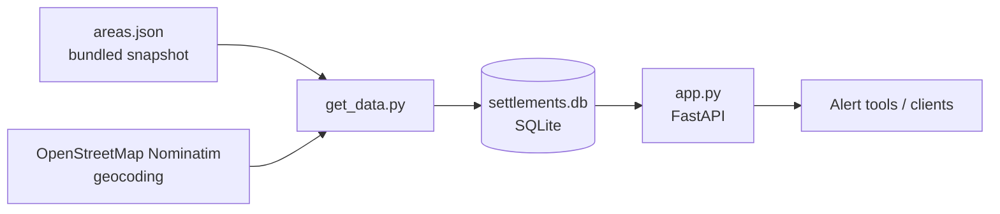

# settelments-alert-data

A small Python service that serves reference data about Israeli settlements for red-alert
(rocket and missile alert) tools. It is meant to load a bundled list of 1,447 entries
(1,446 settlements plus one nationwide "ברחבי הארץ" entry) from `areas.json` into a local
SQLite database, add coordinates for each one, and expose the records through a FastAPI REST
API. For each settlement the API is meant to return its alert area, its `migun_time` (time
to reach a protected space, in seconds) and its latitude and longitude.

> [!IMPORTANT]
> **The project doesn't work in its current state.** The API fails to start: FastAPI
> rejects `app.py` while loading it, so no endpoint is served. The data loader
> (`get_data.py`) also fails on the bundled data and leaves the database empty. See
> [Known issues and limitations](#known-issues-and-limitations).

The repository name keeps its original spelling, `settelments`. The rest of this document
uses "settlements".

> [!WARNING]
> **Unofficial project. Not for life-safety decisions.**
> This project is not affiliated with, endorsed by, or connected to the Israeli Home Front
> Command (Pikud HaOref). The bundled data is a static snapshot and may be outdated,
> incomplete or wrong. The `migun_time` values come from the source data as-is. Never rely
> on them instead of official guidance. Always follow the official Home Front Command
> alerts, app and instructions.

## Table of contents

- [Features](#features)
- [How it works](#how-it-works)
- [Data](#data)
- [Database](#database)
- [Requirements](#requirements)
- [Installation](#installation)
- [Running the API](#running-the-api)
- [Configuration](#configuration)
- [API reference](#api-reference)
- [Updating the data](#updating-the-data)
- [Security notes](#security-notes)
- [Known issues and limitations](#known-issues-and-limitations)
- [Development](#development)
- [Contributing](#contributing)
- [Releases](#releases)
- [License](#license)

## Features

- Bundled dataset (`areas.json`) of 1,447 entries (1,446 settlements plus one nationwide
  "ברחבי הארץ" entry) in 30 alert areas, with Hebrew names,
  regional council and `migun_time`.
- A loader script (`get_data.py`) that creates the database and geocodes each settlement
  with OpenStreetMap Nominatim.
- SQLite storage through SQLAlchemy, with two tables: `areas` and `settlements`.
- A FastAPI app with endpoints to look up, create, update and delete settlements.
- Interactive API docs from FastAPI at `/docs` (Swagger UI) and `/redoc`.

## How it works



1. `get_data.py` creates the tables (`init_db()`), then reads `areas.json`.
2. For each entry it creates the area if it doesn't exist yet and looks up the settlement's
   coordinates by its Hebrew name (`label_he`) with the Nominatim search API. If the lookup
   fails or finds nothing, the coordinates are stored as `0.0, 0.0`.
3. It inserts one `Settlement` row per entry and commits once at the end. If anything fails,
   the whole run is rolled back.
4. `app.py` reads from and writes to the same `settlements.db` file.

## Data

### Source

`areas.json` is a static file committed to the repository. Nothing in this repository
downloads or refreshes it. The code doesn't record where the snapshot came from. Its fields
(`areaid`, `areaname`, `value`, `label_he`, `migun_time`) look like those of the public city
list used by the Home Front Command alert website, but this isn't confirmed. <!-- TODO: verify the origin and date of the areas.json snapshot -->

The only network source the code uses is OpenStreetMap Nominatim
(`https://nominatim.openstreetmap.org/search`), and only to add coordinates while loading
the database.

### `areas.json` schema

The file is a JSON array with one object per settlement. Values are in Hebrew.

| Field | Type | Example | Meaning | Stored as |
|---|---|---|---|---|
| `areaid` | integer | `1` | Alert area ID (30 distinct areas) | `areas.areaid`, `settlements.areaid` |
| `areaname` | string | `אילת` | Alert area name | `areas.areaname` |
| `id` | string of digits | `"74"` | Settlement ID, unique in the file | `settlements.settlementid` (converted to integer) |
| `value` | string | `"124FC5752F86660B7458D50DCE51AE40"` | Identifier from the source data: a 32-character hex string, except `CITY_AL` for the nationwide "ברחבי הארץ" entry (id `1390`) | Not stored |
| `label` | string | `אזור תעשייה שחורת` | Settlement name (same as `label_he` in every entry of the current file) | Not stored |
| `label_he` | string | `אזור תעשייה שחורת` | Settlement name in Hebrew | `settlements.settlementname`, and the Nominatim search query |
| `rashut` | string or `null` | `מועצה אזורית: חבל אילות` | Regional council, in the form `מועצה אזורית: <name>` (`null` in 442 entries) | `settlements.rashut` |
| `migun_time` | integer | `30` | Time to reach a protected space, in seconds, from the source data | `settlements.migun_time` |

`migun_time` values in the current file are `0`, `15`, `30`, `45`, `60` and `90`.

Example entry:

```json
{
  "areaid": 1,
  "areaname": "אילת",
  "id": "91",
  "value": "47996B5FC9D96389F47865B0DC7E21E2",
  "label": "אילות",
  "rashut": "מועצה אזורית: חבל אילות",
  "label_he": "אילות",
  "migun_time": 30
}
```

## Database

- **Engine:** SQLite through SQLAlchemy (`database/connector.py`).
- **URL:** `sqlite:///settlements.db`, hardcoded. This is a relative path, so the file is
  created in the directory you run the command from. Run both `get_data.py` and the API from
  the repository root so they use the same file.
- **Environment variables:** none. The database URL can't be changed without editing
  `database/connector.py`.
- The database file isn't committed. You create it with `get_data.py`.

### Tables

**`areas`** (`models/area.py`)

| Column | Type | Notes |
|---|---|---|
| `areaid` | Integer | Primary key |
| `areaname` | String | Unique, not null |

**`settlements`** (`models/settlement.py`)

| Column | Type | Notes |
|---|---|---|
| `settlementid` | Integer | Primary key |
| `settlementname` | String | Not null |
| `migun_time` | Integer | Not null, seconds |
| `rashut` | String | Nullable |
| `latitude` | Float | Not null, `0.0` when geocoding failed |
| `longitude` | Float | Not null, `0.0` when geocoding failed |
| `areaid` | Integer | Foreign key to `areas.areaid` |

## Requirements

- Python 3 (the code was tested on Python 3.12) <!-- TODO: verify the minimum Python version; the code doesn't declare one -->
- The packages in `requirements.txt` (unpinned): `fastapi`, `sqlalchemy`, `uvicorn`,
  `requests`, `loguru`
- Internet access to `nominatim.openstreetmap.org` while loading the data

## Installation

```bash
git clone https://github.com/t0mer/settelments-alert-data.git
cd settelments-alert-data
python3 -m venv .venv
source .venv/bin/activate
pip install -r requirements.txt
```

Then build the database from the bundled data (see [Updating the data](#updating-the-data)):

```bash
python get_data.py
```

Note: `python get_data.py` currently leaves both tables empty, because of a loader bug
described under [Known issues](#known-issues-and-limitations).

## Running the API

`main.py` is empty and `app.py` has no `__main__` block, so `python main.py` does nothing.
Start the app with uvicorn from the repository root:

```bash
uvicorn app:app --host 0.0.0.0 --port 8000
```

Host and port aren't set in the code. Uvicorn defaults to `127.0.0.1:8000` if you leave out
`--host` and `--port`.

Interactive docs are then at `http://<host>:8000/docs`.

**The app doesn't start in its current form.** The `PUT` and `POST` routes declare the
SQLAlchemy `Settlement` model as their request body, which FastAPI doesn't support. Importing
`app.py` fails at the `@app.put` decorator with
`fastapi.exceptions.FastAPIError: Invalid args for response field!`, so uvicorn exits and no
endpoint is served. See [Known issues and limitations](#known-issues-and-limitations).

## Configuration

The code reads no environment variables, config files or command-line flags. Everything is
hardcoded:

| Setting | Value | Where |
|---|---|---|
| Database URL | `sqlite:///settlements.db` | `database/connector.py` |
| Source data file | `areas.json` | `get_data.py` |
| Geocoding service | `https://nominatim.openstreetmap.org/search` | `get_data.py` |
| Host and port | Set on the `uvicorn` command line (default `127.0.0.1:8000`) | uvicorn |

## API reference

This section describes the routes as `app.py` declares them. **None of them is currently
served**, because the app fails to load (see [Running the API](#running-the-api)).

All endpoints are unauthenticated. Errors use FastAPI's default shape,
`{"detail": "..."}`.

### `GET /settlement/`

Looks up a settlement by its exact Hebrew name.

| Parameter | In | Type | Required | Description |
|---|---|---|---|---|
| `settlement_name` | query | string | yes | Exact match on `settlementname` (the `label_he` value) |

```bash
curl -G "http://localhost:8000/settlement/" --data-urlencode "settlement_name=אילות"
```

Response `200`:

```json
{
  "areaname": "אילת",
  "settlementname": "אילות",
  "settlementid": 91,
  "migun_time": 30,
  "latitude": 29.0,
  "longitude": 35.0
}
```

The coordinates above are placeholders. Real values come from Nominatim. `rashut` isn't
returned. If several settlements share a name, only the first match is returned.

Response `404`: `{"detail": "Settlement not found"}`

### `POST /settlement/`

Creates a settlement.

- **Body:** undefined. The route declares the SQLAlchemy `Settlement` model as its body
  type, which FastAPI rejects when the app loads. The intent is a settlement object with the
  columns listed under [Tables](#tables).
- **Response `200`:** `{"message": "Settlement created"}`

### `PUT /settlement/{settlement_id}`

Updates a settlement's `settlementname`, `migun_time`, `rashut`, `latitude` and `longitude`.
The area can't be changed.

| Parameter | In | Type | Required | Description |
|---|---|---|---|---|
| `settlement_id` | path | integer | yes | Settlement ID |

- **Body:** undefined, for the same reason as `POST`.
- **Response `200`:** `{"message": "Settlement updated"}`
- **Response `404`:** `{"detail": "Settlement not found"}`

### `DELETE /settlement/{settlement_id}`

Deletes a settlement.

| Parameter | In | Type | Required | Description |
|---|---|---|---|---|
| `settlement_id` | path | integer | yes | Settlement ID |

```bash
curl -X DELETE "http://localhost:8000/settlement/91"
```

- **Response `200`:** `{"message": "Settlement deleted"}`
- **Response `404`:** `{"detail": "Settlement not found"}`

### Built-in FastAPI routes

| Path | Purpose |
|---|---|
| `/docs` | Swagger UI |
| `/redoc` | ReDoc |
| `/openapi.json` | OpenAPI schema |

## Updating the data

1. Replace `areas.json` with a newer snapshot that has the same fields (see
   [`areas.json` schema](#areasjson-schema)).
2. Delete the old `settlements.db`. The loader only inserts rows, so running it against an
   existing database fails on duplicate IDs and rolls back everything.
3. Run the loader from the repository root:

   ```bash
   rm -f settlements.db
   python get_data.py
   ```

Note: `python get_data.py` currently leaves both tables empty, because of the loader bug
described under [Known issues](#known-issues-and-limitations).

The loader sends one Nominatim request per settlement (about 1,450 requests) with no delay
between them. Nominatim's
[usage policy](https://operations.osmfoundation.org/policies/nominatim/) allows at most one
request per second and asks for an identifying `User-Agent`. Check the policy before running
the loader, and expect it to take a while.

## Security notes

- The API has **no authentication or authorization**. Anyone who can reach it can create,
  change or delete settlements. Bind it to `127.0.0.1` or a private network, or put it
  behind a reverse proxy with authentication, before exposing it.
- There is no rate limiting and no CORS configuration.
- The data isn't authoritative. Treat anything the API returns as informational only, and
  don't use it to drive life-safety decisions.
- The database is a local SQLite file with no encryption. It holds only public reference
  data, but protect write access to it.

## Known issues and limitations

These were found by reviewing the code, and the first two were confirmed by offline tests. They are not fixed here.

- **The app never starts.** `update_settlement` and `create_settlement` in `app.py` use
  the SQLAlchemy `Settlement` model as the request body. FastAPI needs a Pydantic model, so
  importing `app.py` fails at the `@app.put` decorator with
  `fastapi.exceptions.FastAPIError: Invalid args for response field!`. No endpoint is
  served, not even `GET` or `DELETE`. This happens with both Pydantic 1 and Pydantic 2
  versions of FastAPI.
- **`main.py` is empty.** Use `uvicorn app:app` to run the service.
- **The loader always fails on the bundled data.** The session uses `autoflush=False`
  (`database/connector.py`), so the "does this area exist?" query in `get_data.py` never
  sees areas added earlier in the same run. It creates one `Area` row per entry (1,447 in
  all), and the final commit fails with
  `sqlite3.IntegrityError: UNIQUE constraint failed: areas.areaid`. Everything is rolled
  back, leaving 0 areas and 0 settlements. The script only prints the error and still exits
  with code 0.
- **The API never creates its tables.** `app.py` imports `init_db` but never calls it, so
  running the API before `get_data.py` would give "no such table" errors.
- **The loader isn't idempotent.** Re-running it on an existing database fails on duplicate
  settlement IDs and rolls back.
- **Geocoding failures become `0.0, 0.0`** instead of `null`, so they look like real
  coordinates. Names are searched without an area or country qualifier, so some results may
  point to the wrong place.
- **The Nominatim requests don't follow its usage policy**: there is no delay between
  requests, and the `User-Agent` is a generic browser string instead of one that identifies
  the application.
- **Name lookups return only the first match.** 18 names in `areas.json` appear more than
  once.
- **`GET /settlement/` doesn't return `rashut`**, and it would fail with a server error for
  a settlement that has no area.
- **The database path is relative** (`sqlite:///settlements.db`) and can't be configured.
- **Dependencies aren't pinned**, and `loguru` is listed but not used.
- There are no tests, Dockerfile or CI workflows.

## Development

Project layout:

```
.
├── app.py                 # FastAPI app and routes
├── get_data.py            # Creates the database and loads areas.json (with geocoding)
├── main.py                # Empty
├── areas.json             # Bundled data (1,446 settlements + 1 nationwide entry)
├── database/
│   └── connector.py       # SQLite engine, session factory, init_db()
├── models/
│   ├── base.py            # SQLAlchemy declarative base
│   ├── area.py            # Area model (areas table)
│   └── settlement.py      # Settlement model (settlements table)
├── requirements.txt
└── LICENSE
```

Run the API with auto-reload while developing:

```bash
uvicorn app:app --reload
```

There is no test suite or linter configuration yet.

## Contributing

Issues and pull requests are welcome at
[t0mer/settelments-alert-data](https://github.com/t0mer/settelments-alert-data). Please keep
changes focused, and describe how you tested them. Corrections to the data should say where
the updated values come from.

## Releases

There are no GitHub releases, tags or Docker images for this project. Run it from source as
described above.

## License

Licensed under the [Apache License 2.0](LICENSE).
